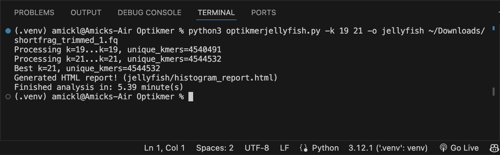
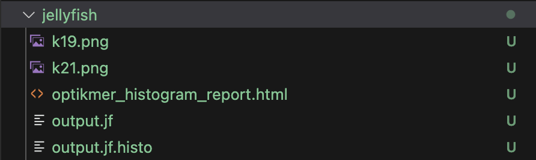
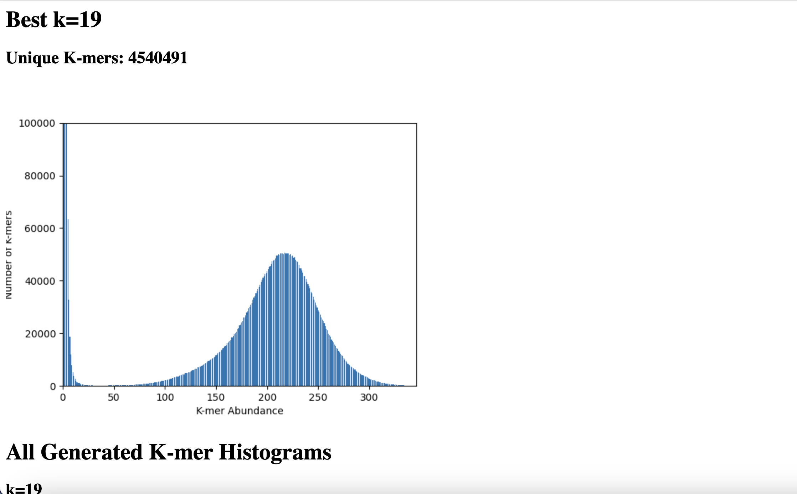

# Optikmer
**Optikmer** is a demonstration project for CSE 185 that estimates the k-mer length associated with the highest amount of distinct k-mers given one or more (filtered) fastq files. It is inspired by k-mer counting programs such as kmerGenie and jellyfish in terms of approximating the best k-mer length for de-novo assembly. See <a href='http://kmergenie.bx.psu.edu/' target='blank'>kmerGenie<a> or <a href='https://github.com/gmarcais/Jellyfish' target='blank'>jellyfish<a> for more references.

# Installation Instructions
**Optikmer** can be installed with the following command: 
``` 
pip install Optikmer/
```

For an editable version, you can use the command:
```
pip install --no-build-isolation -e Optikmer/
```


If successfully installed, please refer to `optikmer --help` for further help.

# Basic Usage
The basic usage of ```optikmer``` is: (To be added soon)
```optikmer [-k KMERS [KMERS ...]] [-o OUTPUT] filtered_read_1.fq filtered_read_2.fq ...```

To run ```optikmer``` on a test example using existing files:
```
optikmer public/shortfrag_trimmed_1.fq
```
For now use: 
```
python (or python3) optikmerjellyfish.py shortfrag_trimmed_1.fq.
```
with the files from lab2 (shortfrag_trimmed_1.fq and/or shortfrag_trimmed_2.fq)

# Optikmer options
**Optikmer** requires at least one filtered/trimmed fastq file. Optional User specifications are below.
- `-k KMERS [KMERS ...]`, `--kmers KMERS [KMERS ...]`: User specifed k-mers to estimate, default is 
```
[11, 21, 31, 41, 51, 61, 71, 81, 91]
```
- `-o OUTPUT`, `--output OUTPUT`: Write to output **DIRECTORY**, default written to current directory.

# Example
**1. Optikmer was installed and run with the following options:**
- `-k`, `--kmer`: [19, 21]
- `-o`, `--output` (directory): jellyfish


**2. All resulting files and images stored in `./jellyfish` directory**


**3. Histogram report displays k-mer length with most unique k-mers at the top**



# Contributors
Project assembled by:
- Amick Licup (ID: A17038320)
- Annapurna Saladi (ID: A17417895)
- Steven Nguyen (ID: A16858016)
