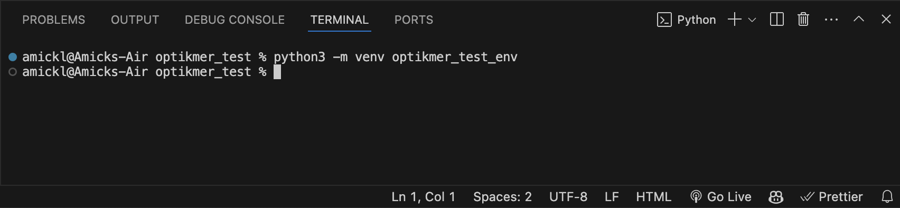
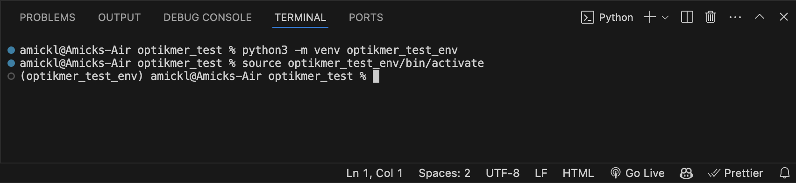
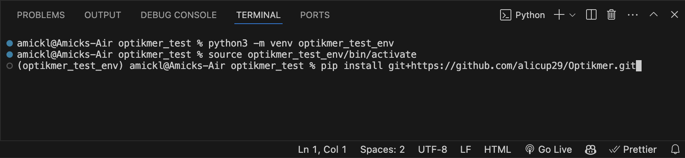
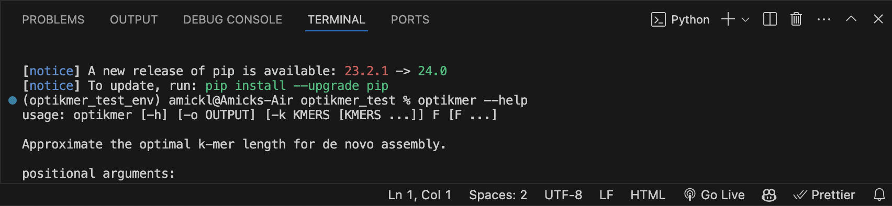
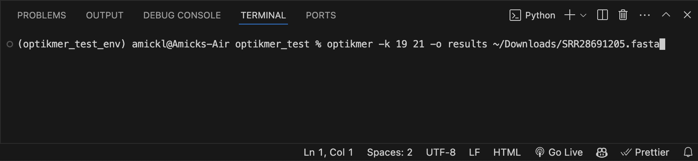
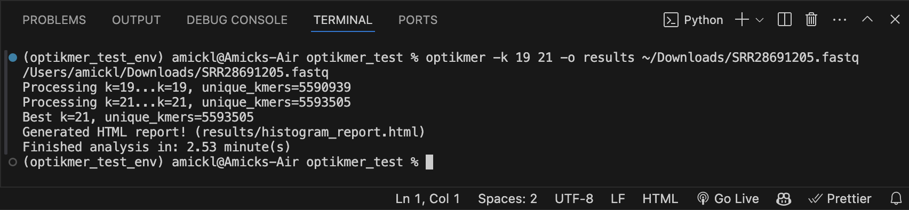
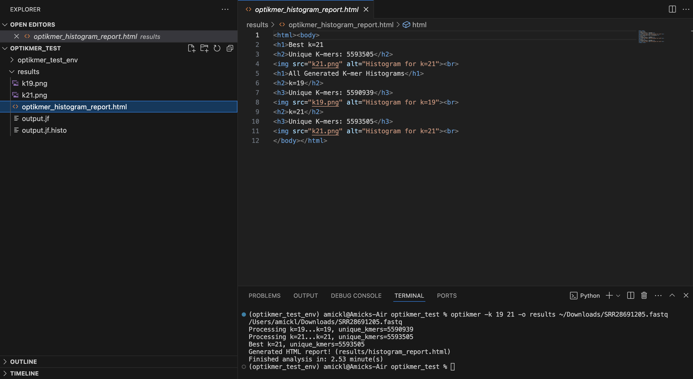
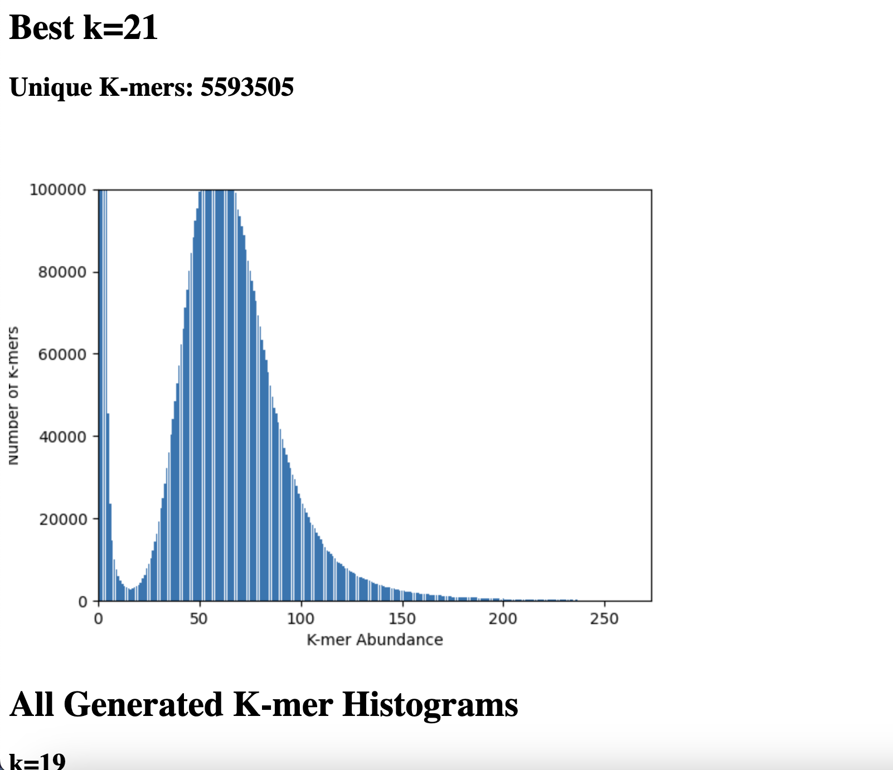

# Optikmer
**Optikmer** is a demonstration project for CSE 185 that estimates the k-mer length associated with the highest amount of distinct k-mers given one or more (filtered) fastq files. It is inspired by k-mer counting programs such as kmerGenie and jellyfish in terms of approximating the best k-mer length for de-novo assembly. See <a href='http://kmergenie.bx.psu.edu/' target='blank'>kmerGenie<a> or <a href='https://github.com/gmarcais/Jellyfish' target='blank'>jellyfish<a> for more references.

# Installation Instructions
**Note:** Installing and activating a virtual environment is highly recommended.

Once in your desired directory, optikmer can be installed with the following command: 
``` 
pip install git+https://github.com/alicup29/Optikmer.git
```

If successfully installed, please refer to `optikmer --help` for further options.

# Basic Usage
The basic usage of ```optikmer``` is:
```
optikmer [-k KMERS [KMERS ...]] [-o OUTPUT] filtered_read_1.fastq filtered_read_2.fasta ...
```
**Note 1:** If inputing compressed files (ex. fastq.gz and/or downloaded from NCBI), please **uncompress with gunzip/zcat beforehand** and use resulting fastq/fasta file.

**Note 2:** If specifying k-mer length(s), **enter -k option FIRST, THEN -o to desired directory is required** (. if current directory).

For example, the following command with analyze the fasta file ONLY with k=19, and output results to the current directory.
```
optikmer -k 19 -o . ~/Downloads/SRR28691205.fasta
```

# Optikmer options
**Optikmer** requires at least one filtered/trimmed fastq file, optional User specifications are below.
- `-k KMERS [KMERS ...]`, `--kmers KMERS [KMERS ...]`: User specifed k-mers to estimate, default is 
```
[11, 21, 31, 41, 51, 61, 71, 81, 91]
```
- `-o OUTPUT`, `--output OUTPUT`: Write to output **DIRECTORY**, default written to current directory.

# Example
**1. Optikmer was installed and run with the following options:**
- `-k`, `--kmer`: [19, 21]
- `-o`, `--output` (directory): results

1a. Open and activate virtual environment
 


1b. Install and check optikmer



1c. Ran with following command



**2. All resulting files and images stored in `./results` directory**



**3. Histogram report displays k-mer length with most unique k-mers at the top**



# Contributors
Project assembled by:
- Amick Licup (ID: A17038320)
- Annapurna Saladi (ID: A17417895)
- Steven Nguyen (ID: A16858016)
